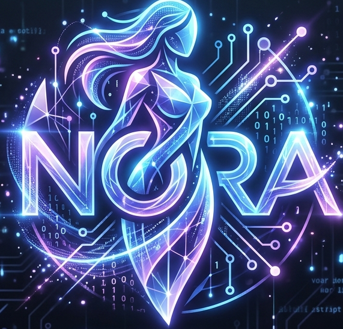

<p align="center">
  
</p>

```
███╗   ██╗ ██████╗ ██████╗  █████╗
████╗  ██║██╔═══██╗██╔══██╗██╔══██╗
██╔██╗ ██║██║   ██║██████╔╝███████║
██║╚██╗██║██║   ██║██╔══██╗██╔══██║
██║ ╚████║╚██████╔╝██║  ██║██║  ██║
╚═╝  ╚═══╝ ╚═════╝ ╚═╝  ╚═╝╚═╝  ╚═╝
```

# Nora — Your Personal AI Companion

<p align="center">
  <a href="https://github.com/vexdeathgrip/Nora"></a>
  <a href="https://github.com/NousResearch/hermes-agent/blob/main/LICENSE"></a>
  <a href="https://nousresearch.com"></a>
</p>

Nora is a personalized AI companion built on top of [Hermes Agent](https://github.com/NousResearch/hermes-agent). She learns about you over time, explores the world autonomously, and builds a deepening model of who you are across sessions.

## What Makes Nora Different

- **Autonomous exploration** — Nora learns on her own, researching topics and saving what she finds
- **Self-improvement** — She identifies gaps in her capabilities and works to fill them
- **Memory that grows** — Her understanding of you deepens with every conversation
- **Scheduled automations** — Nightly exploration, memory reconciliation, routine analysis
- **Proactive check-ins** — She reaches out when she hasn't heard from you
- **Session-scoped tasks** — Clean slate every conversation, no lingering state

## Quick Setup

```bash
# Clone Nora
git clone git@github.com:vexdeathgrip/Nora.git
cd Nora

# Install
pip install -e .

# Setup (installs plugins, skills, cron jobs, config)
nora setup
```

## What's Included

| Component | Description |
|-----------|-------------|
| `nora/plugins/` | todo-list, self-update, vector-context |
| `nora/skills/` | autonomy — teaches Nora to use her tools synergistically |
| `nora/cron/` | 5 scheduled jobs: exploration, memory, routine, check-ins, health |
| `nora/config/` | Pre-configured for local LLM (qwen-pro via llama.cpp) |
| `nora/systemd/` | llama.service for auto-starting the model server |

## Commands

Everything works exactly like Hermes:

```bash
nora                          # Start interactive chat
nora chat -q "Hello"          # Single query mode
nora chat --continue          # Continue most recent session
nora -c                       # Resume last session
nora setup                    # Install Nora's plugins and config
nora cron list                # View scheduled jobs
nora logs                     # View logs
nora --help                   # See all commands
```

## Architecture

```
Nora (nora_cli.py)
  └── wraps hermes CLI
        ├── plugins/
        │   ├── todo_list      — session-scoped task management
        │   ├── self_update    — read/write SELF.md identity
        │   └── vector_context — semantic search across memories
        ├── cron/
        │   ├── nightly-exploration     — learn something new every night
        │   ├── nightly-memory-reconcile — clean up memory files
        │   ├── nightly-routine-builder  — analyze your routine patterns
        │   ├── proactive-checkin        — reach out every 4 hours
        │   └── health-monitor          — check system health every 12h
        └── skills/
            └── autonomy — synergy patterns for autonomous operation
```

## Memory Files

Nora maintains several memory files in `~/.hermes/memories/`:

- **USER.md** — What she knows about you
- **SELF.md** — Her identity and self-awareness
- **MEMORY.md** — Facts and observations she's collected
- **ROUTINE.md** — Your daily patterns and habits

These are cleaned up nightly and inform how she interacts with you.

## License

MIT — Built on [Hermes Agent](https://github.com/NousResearch/hermes-agent) by [Nous Research](https://nousresearch.com).
